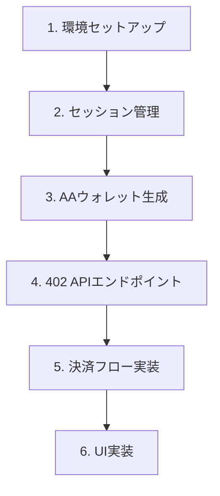

# TECHNICAL DESIGN SPECIFICATION

## Core Vision & Goals

### 実現したいこと

**「ウォレットアプリ不要で、誰でも簡単にマイクロペイメントでコンテンツを購入できるシステム」**

#### 主要目標
1. **ウォレットインストール不要** - ブラウザだけで完結
2. **ガスレス決済** - ユーザーはガス代を意識しない
3. **シームレスなUX** - 通常のWebサービスと同等の体験
4. **マイクロペイメント対応** - 小額決済でも手数料が現実的

### なぜこれが重要か


## System Overview

402 Payment Requiredを利用したマイクロペイメントシステムの設計仕様書。
アカウントアブストラクション（ERC-4337）を活用し、ガスレストランザクションを実現する。

## User Experience Requirements

### 必須要件

1. **ウォレットアプリ不要**
   - MetaMask等のインストール不要
   - ブラウザ内で完結する体験
   - Social Login（Google/Email）でアカウント作成

2. **ガスレス体験**
   - ユーザーはETHを持つ必要がない
   - ガス代はPaymasterが負担
   - 支払いはコンテンツ料金のみ

3. **シンプルな支払いフロー**
   - 1クリックで支払い完了
   - 402エラー → 支払いボタン → 完了
   - 決済確認の待ち時間を最小化

### システム要件


## Customer Journey Map

### シンプルなユーザージャーニー


## Core System Components

### 実現に必要な要素


### 技術選定の理由

| コンポーネント | 技術選択 | 理由 |
|---|---|---|
| 認証 | NextAuth + Social Login | ウォレット不要でユーザー識別 |
| データベース | Firestore | リアルタイム同期、スケーラブル、サーバーレス |
| 状態管理 | Zustand | シンプルで軽量 |
| ブロックチェーン接続 | Viem + Wagmi | AA対応、TypeScript完全対応 |
| スマートコントラクト | ERC-4337準拠 | 標準化されたAA実装 |
| Bundler | Pimlico/Stackup | 実績のあるサービス |
| Paymaster | Pimlico Paymaster | 簡単な統合、柔軟な設定 |

## System Architecture

### 1. High-Level Architecture


## User Flow Diagrams

### 1. 402 Payment Flow


### 2. Automatic AA Wallet Creation Flow


## Class Diagrams

### 1. Simplified Domain Model


### 2. Smart Contract Architecture


## Sequence Diagrams

### 1. 402 Payment Sequence


### 2. AA Wallet Creation Sequence


## Firestore Collection Design

### 最小構成のコレクション設計

| コレクション | ドキュメントID | フィールド | 説明 |
|---|---|---|---|
| **users** | {userId} | aaWalletAddress | AAウォレットアドレス |
| **contents** | {contentId} | preview | 無料プレビュー |
| | | content | 有料本文 |
| | | price | 価格（Wei単位） |
| **accessList** | {userId} | - | 存在確認のみ |

### インデックス設計

```yaml
# Composite Indexes
- collection: contents
  fields:
    - creatorId: ASC
    - createdAt: DESC
    
- collection: contents
  fields:
    - isActive: ASC
    - tier: ASC
    - createdAt: DESC
    
- collection: payments
  fields:
    - payerId: ASC
    - createdAt: DESC
    
- collection: payments
  fields:
    - creatorId: ASC
    - status: ASC
    - createdAt: DESC
```

### Firestore設計の考慮事項

1. **NoSQLデータモデリング**
   - 非正規化を活用（例：creatorAddressをcontentドキュメントに含める）
   - 読み取り最適化のため、集約データをドキュメント内に保持
   - JOINが不要な設計

2. **リアルタイム同期**
   - 支払い状態の変更をリアルタイムで反映
   - コンテンツアクセス権の即時更新
   - onSnapshot()を活用したUI更新

3. **スケーラビリティ**
   - ドキュメントサイズ制限（1MB）を考慮
   - サブコレクションで大量データを分離
   - シャーディングカウンタパターンで高頻度更新に対応

4. **セキュリティルール**
   
   **Firestore Security Rulesの設定**
   - contents: 認証ユーザーは読み取り可
   - accessList: 本人のみ読み取り可
   - 書き込みはサーバー側からのみ

## AA Infrastructure Services

### 使用するサービス選定

#### 1. Bundler Service
**選択: Pimlico**
- API: `https://api.pimlico.io/v2/base-sepolia/rpc`
- 理由:
  - 安定性が高い
  - ドキュメントが充実
  - 無料枠あり（テスト用）
  - TypeScript SDKあり

#### 2. Paymaster Service
**選択: Pimlico Paymaster**
- VerifyingPaymaster契約を使用
- スポンサーシップポリシー設定可能
- 理由:
  - Bundlerと同じプロバイダーで統合が簡単
  - 柔軟なガス代スポンサー設定

#### 3. Account Factory
**選択: Safe (Gnosis) Account Factory**
- 実績のあるスマートウォレット実装
- ERC-4337完全準拠
- 監査済みコード

### 実装フロー


### SDK/ライブラリ選定

| 用途 | ライブラリ | 理由 |
|---|---|---|
| AA操作 | permissionless.js | Pimlico推奨、TypeScript対応 |
| Ethereum接続 | viem | 軽量、TypeScript完全対応 |
| ウォレット管理 | @safe-global/safe-core-sdk | Safe wallet操作 |

### 環境変数設定

| 環境変数 | 値 | 説明 |
|---|---|---|
| PIMLICO_API_KEY | (取得必要) | Pimlico APIキー |
| PIMLICO_BUNDLER_URL | https://api.pimlico.io/v2/base-sepolia/rpc | Bundlerエンドポイント |
| PIMLICO_PAYMASTER_URL | https://api.pimlico.io/v2/base-sepolia/rpc | Paymasterエンドポイント |
| ACCOUNT_FACTORY_ADDRESS | (ネットワークごと) | Safe Factoryアドレス |
| PAYMASTER_ADDRESS | (ネットワークごと) | Paymasterアドレス |
| ENTRY_POINT_ADDRESS | 0x5FF137D4b0FDCD49DcA30c7CF57E578a026d2789 | ERC-4337 EntryPoint |

## 外部サービス依存関係

### 依存サービス一覧

| サービス種別 | プロバイダー | 用途 | 代替可能性 | 停止時の影響 |
|---|---|---|---|---|
| **Bundler** | Pimlico | UserOperation送信・実行 | 高（Stackup, Alchemy等） | 新規決済不可 |
| **Paymaster** | Pimlico | ガス代スポンサー | 高（自前Paymaster可） | ユーザーがガス代負担必要 |
| **RPC Node** | Alchemy/Infura | ブロックチェーン接続 | 高（複数プロバイダー） | 全機能停止 |
| **Database** | Firestore | ユーザー・コンテンツ管理 | 中（他NoSQL可） | アプリ停止 |
| **Hosting** | Vercel | フロントエンド配信 | 高（Netlify等） | UI表示不可 |

### 自前実装 vs 外部依存

| 機能 | 自前実装 | 外部サービス | 選択理由 |
|---|---|---|---|
| **AAウォレット生成** | Smart Contract作成必要 | Safe Factory利用 | 監査済み・実績あり |
| **UserOp実行** | Bundler開発必要 | Pimlico Bundler | 開発コスト大 |
| **ガス代スポンサー** | Paymaster契約必要 | Pimlico Paymaster | 運用が複雑 |
| **署名管理** | 自前実装 ✓ | - | セキュリティ上重要 |
| **セッション管理** | 自前実装 ✓ | - | アプリ固有ロジック |

### サービス停止時の対策


### コスト構造

| サービス | 料金体系 | 想定月額 | 備考 |
|---|---|---|---|
| Pimlico | 従量課金 | $0-100 | 初期は無料枠内 |
| Firestore | 読み書き回数 | $0-50 | 少量なら無料枠内 |
| Vercel | 帯域・ビルド時間 | $0-20 | Hobbyプラン |
| Alchemy | API呼び出し数 | $0 | 無料枠300M CU/月 |

## スマートコントラクト開発の必要性

### 結論：最小限のコントラクトで実現可能

| コントラクト | 必要性 | 理由 |
|---|---|---|
| **Account Factory** | ❌ 不要 | Safe等の既存Factory使用 |
| **AA Wallet実装** | ❌ 不要 | Safe Account使用 |
| **Paymaster** | ❌ 不要 | Pimlico Paymaster使用 |
| **EntryPoint** | ❌ 不要 | ERC-4337標準を使用 |
| **Content Registry** | ⚠️ 検討 | オンチェーン決済記録が必要な場合 |
| **Payment Token** | ❌ 不要 | ETH決済で十分 |

### アプローチ：既存インフラを最大活用


### メリット・デメリット

#### 既存コントラクト利用のメリット
1. **開発コスト削減** - 実装・テスト・監査不要
2. **セキュリティ** - 実績のある監査済みコード
3. **メンテナンス不要** - アップデートは提供側
4. **即座に利用可能** - デプロイ不要

#### デメリット
1. **カスタマイズ制限** - 独自機能追加困難
2. **外部依存** - 仕様変更の影響
3. **手数料** - Paymasterの利用料

### 将来的な拡張時の検討

オンチェーンコンテンツ管理が必要になった場合：
- コンテンツ価格のマッピング
- アクセス権のオンチェーン管理
- 購入関数の実装

### 推奨アプローチ

1. **Phase 1（現在）**: コントラクト開発なし
   - 既存インフラのみで実装
   - Firestore でアクセス管理
   - 決済履歴もオフチェーン

2. **Phase 2（将来）**: 必要に応じて追加
   - オンチェーン決済証明が必要な場合
   - 分散型を強調したい場合
   - トークンゲートが必要な場合

## Coinbase x402 ライブラリの検討

### x402 vs 独自実装

| 項目 | Coinbase x402 | 独自実装（AA） |
|---|---|---|
| **決済方法** | ステーブルコイン（USDC等） | ETH |
| **ガス代** | ユーザー負担 | Paymaster負担（ガスレス） |
| **ウォレット** | 既存ウォレット必要 | AAウォレット自動生成 |
| **実装の簡単さ** | 1行で実装可能 | カスタム実装必要 |
| **最小決済額** | $0.001 | 制限なし |
| **決済時間** | 2秒 | 5-10秒 |

### 結論：独自実装を選択

**理由：**
1. **ウォレット不要** - x402は既存ウォレット必要、我々はウォレット不要を目指す
2. **完全ガスレス** - x402はガス代ユーザー負担、我々はPaymaster使用
3. **ETH決済** - 日本ユーザーにはETHの方が馴染みあり
4. **カスタマイズ性** - AA統合により柔軟な実装可能

ただし、x402の設計思想（HTTPヘッダー利用等）は参考にする。

## API設計

### 402 Payment Required レスポンス仕様

#### 未購入時（402）
- ステータスコード: 402
- ヘッダー:
  - X-Payment-Required: true
  - X-Payment-Amount: 支払い額（ETH）
  - X-Payment-Currency: ETH
  - X-Payment-Network: base-sepolia
  - X-Content-Id: コンテンツID
- ボディ: プレビュー、価格、コンテンツID

#### 購入済み（200）
- ステータスコード: 200
- ボディ: 完全なコンテンツ、コンテンツID

### 主要エンドポイント

| エンドポイント | メソッド | 用途 | 認証 |
|---|---|---|---|
| `/api/content` | GET | コンテンツ一覧取得 | 不要 |
| `/api/content/{id}` | GET | コンテンツ取得（402対応） | セッション |
| `/api/content` | POST | コンテンツ作成 | セッション |
| `/api/payment/process` | POST | 支払い処理開始 | セッション |
| `/api/user/wallet` | GET | AAウォレット情報取得 | セッション |

## ユーザー識別とセッション管理

### セッションベースの識別


### データフロー

1. **初回アクセス時**
   - セッションID生成
   - ユーザーID生成
   - AAウォレット生成（バックグラウンド）
   - Firestore保存

2. **コンテンツアクセス時**
   - accessList確認
   - 未購入→402レスポンス
   - 購入済→200レスポンス

## 決済フロー詳細

### UserOperation構築

#### UserOperationパラメータ

| パラメータ | 値/説明 |
|---|---|
| sender | AAウォレットアドレス |
| nonce | ウォレットの現在のnonce |
| initCode | 0x（デプロイ済みの場合） |
| callData | execute関数のエンコードデータ |
| callGasLimit | 100000 |
| verificationGasLimit | 200000 |
| preVerificationGas | 50000 |
| maxFeePerGas | 動的に取得 |
| maxPriorityFeePerGas | 2 Gwei |
| paymasterAndData | Pimlicoから取得 |
| signature | サーバー側で生成 |

## State Machine Diagrams

### 1. Payment State Machine


### 2. Content Lifecycle State Machine


## 実装タスク一覧

### 1. 環境セットアップ
- [ ] Pimlicoアカウント作成・APIキー取得
- [ ] Firebase プロジェクト作成
- [ ] Vercel プロジェクト作成
- [ ] 環境変数設定

### 2. Backend実装
- [ ] Next.js APIルート作成
  - [ ] `/api/content` - 一覧・作成
  - [ ] `/api/content/[id]` - 402対応
  - [ ] `/api/payment/process` - 決済処理
  - [ ] `/api/user/wallet` - ウォレット情報
- [ ] Firestore接続設定
- [ ] セッション管理実装

### 3. AA Integration
- [ ] permissionless.js セットアップ
- [ ] AAウォレット生成ロジック
- [ ] UserOperation作成・署名
- [ ] Pimlico Bundler接続

### 4. Frontend実装
- [ ] コンテンツ一覧画面
- [ ] 402エラーハンドリング
- [ ] 支払いUI（自動実行）
- [ ] 購入済みコンテンツ表示

### 5. 動作確認
- [ ] Base Sepoliaでのテスト
- [ ] ガスレス決済の確認
- [ ] セッション永続性の確認

### 実装の優先順位



