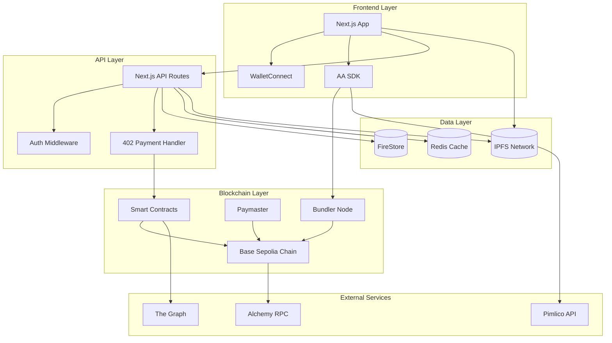
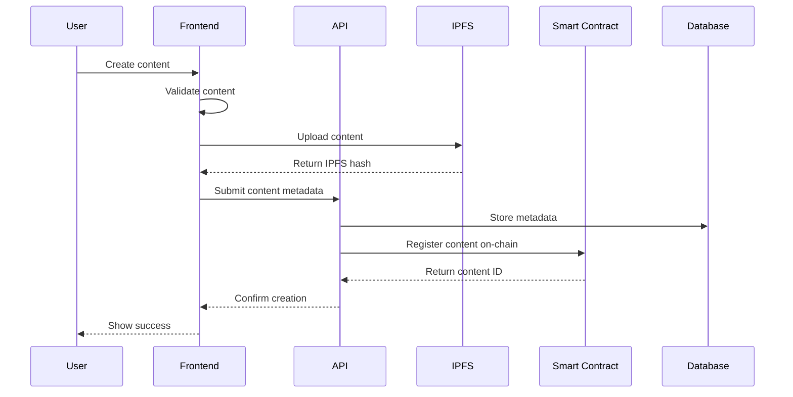
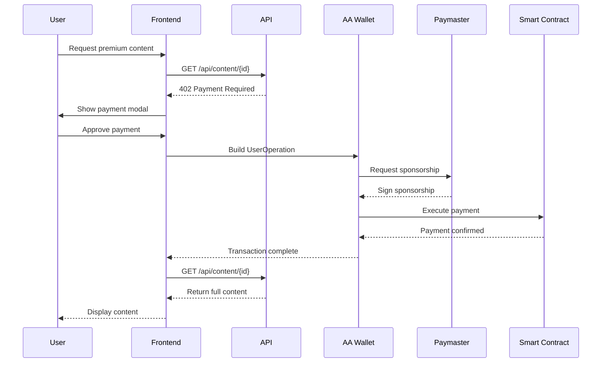
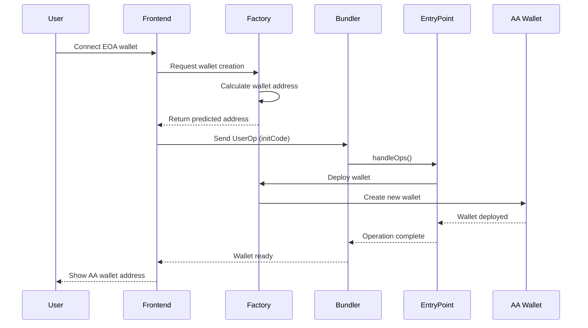

# ARCHITECTURE OVERVIEW

## System Architecture Diagram



## Component Architecture

### 1. Frontend Components

```
application/
├── app/
│   ├── (auth)/
│   │   ├── login/
│   │   └── connect/
│   ├── (dashboard)/
│   │   ├── feed/
│   │   ├── create/
│   │   └── profile/
│   ├── api/
│   │   ├── auth/
│   │   ├── content/
│   │   └── payment/
│   └── layout.tsx
├── components/
│   ├── auth/
│   │   ├── WalletConnect.tsx
│   │   └── AAWalletCreator.tsx
│   ├── content/
│   │   ├── ContentCard.tsx
│   │   ├── ContentCreator.tsx
│   │   └── PaymentModal.tsx
│   ├── payment/
│   │   ├── PaymentButton.tsx
│   │   └── TransactionStatus.tsx
│   └── shared/
│       ├── Header.tsx
│       └── Footer.tsx
├── hooks/
│   ├── use402Payment.ts
│   ├── useAAWallet.ts
│   └── useContent.ts
├── lib/
│   ├── wagmi.ts
│   ├── pimlico.ts
│   └── ipfs.ts
└── services/
    ├── aaWallet.service.ts
    ├── payment.service.ts
    └── content.service.ts
```

### 2. Smart Contract Architecture

```
web3/
├── src/
│   ├── core/
│   │   ├── ContentRegistry.sol
│   │   ├── PaymentProcessor.sol
│   │   └── AccessControl.sol
│   ├── aa/
│   │   ├── Account.sol
│   │   ├── AccountFactory.sol
│   │   └── Paymaster.sol
│   ├── interfaces/
│   │   ├── IContent.sol
│   │   ├── IPayment.sol
│   │   └── IAccount.sol
│   └── libraries/
│       ├── PaymentLib.sol
│       └── ContentLib.sol
├── script/
│   ├── Deploy.s.sol
│   └── UFSrade.s.sol
└── test/
    ├── ContentRegistry.t.sol
    ├── PaymentProcessor.t.sol
    └── Integration.t.sol
```

## Data Flow Diagrams

### 1. Content Creation Flow



### 2. 402 Payment Flow



### 3. Account Abstraction Flow



## State Management

### 1. Frontend State

```typescript
// Global State Structure
interface AppState {
    auth: {
        isConnected: boolean;
        address: string | null;
        aaWallet: string | null;
    };
    content: {
        items: Content[];
        loading: boolean;
        filter: ContentFilter;
    };
    payment: {
        pending: Transaction[];
        history: Transaction[];
    };
    ui: {
        modal: ModalState;
        notifications: Notification[];
    };
}
```

### 2. Smart Contract State

```solidity
// Core State Variables
contract ContentRegistry {
    // Content storage
    mapping(uint256 => Content) public contents;
    mapping(address => uint256[]) public userContents;
    mapping(uint256 => mapping(address => bool)) public hasAccess;
    
    // Payment tracking
    mapping(uint256 => uint256) public contentRevenue;
    mapping(address => uint256) public creatorEarnings;
    
    // Platform settings
    uint256 public platformFee = 500; // 5%
    address public platformWallet;
    
    // Access control
    mapping(address => bool) public moderators;
}
```

## Security Architecture

### 1. Smart Contract Security

```
┌─────────────────────────────────────────┐
│          Security Layers                 │
├─────────────────────────────────────────┤
│  1. Access Control (OpenZeppelin)       │
│  2. Reentrancy Guards                   │
│  3. Input Validation                    │
│  4. Rate Limiting                       │
│  5. Pausable Contracts                  │
│  6. UFSrade Proxy Pattern               │
└─────────────────────────────────────────┘
```

### 2. API Security

```typescript
// Security Middleware Stack
app.use(cors(corsOptions));
app.use(helmet());
app.use(rateLimit({
    windowMs: 15 * 60 * 1000, // 15 minutes
    max: 100 // limit each IP to 100 requests
}));
app.use(authentication);
app.use(authorization);
app.use(inputValidation);
```

## Performance Optimization

### 1. Caching Strategy

```
┌─────────────────┐     ┌─────────────────┐     ┌─────────────────┐
│   CloudFlare    │────▶│   Redis Cache   │────▶│   PostgreSQL    │
│   (CDN Layer)   │     │  (Memory Cache) │     │   (Database)    │
└─────────────────┘     └─────────────────┘     └─────────────────┘
        │                       │                         │
        ▼                       ▼                         ▼
   Static Assets          Hot Data Cache           Persistent Data
   - Images               - User sessions         - User profiles
   - JS/CSS              - Recent content        - Content metadata
   - Public content      - Access tokens         - Payment history
```

### 2. Database Optimization

```sql
-- Indexes for performance
CREATE INDEX idx_contents_creator ON contents(creator_id);
CREATE INDEX idx_contents_tier ON contents(tier);
CREATE INDEX idx_payments_user ON payments(payer_id);
CREATE INDEX idx_access_user_content ON content_access(user_id, content_id);

-- Materialized views for analytics
CREATE MATERIALIZED VIEW creator_stats AS
SELECT 
    creator_id,
    COUNT(DISTINCT id) as total_contents,
    SUM(views) as total_views,
    SUM(revenue) as total_revenue
FROM contents
GROUP BY creator_id;
```

## Scalability Architecture

### 1. Horizontal Scaling

```
                    Load Balancer
                         │
        ┌────────────────┼────────────────┐
        ▼                ▼                ▼
   API Server 1     API Server 2     API Server 3
        │                │                │
        └────────────────┼────────────────┘
                         ▼
                 Shared Services
              ┌──────────────────┐
              │ - Redis Cluster  │
              │ - PostgreSQL     │
              │ - IPFS Cluster   │
              └──────────────────┘
```

### 2. Microservices Architecture (Future)

```
┌─────────────────┐  ┌─────────────────┐  ┌─────────────────┐
│  Auth Service   │  │ Content Service │  │ Payment Service │
└─────────────────┘  └─────────────────┘  └─────────────────┘
         │                    │                    │
         └────────────────────┼────────────────────┘
                              ▼
                       Message Queue
                      (RabbitMQ/Kafka)
```

## Monitoring & Observability

### 1. Metrics Collection

```yaml
# Prometheus metrics
metrics:
  - api_request_duration_seconds
  - api_request_total
  - payment_transaction_total
  - payment_transaction_failed_total
  - content_creation_total
  - user_registration_total
  - smart_contract_calls_total
  - ipfs_upload_duration_seconds
```

### 2. Logging Architecture

```
Application Logs ──┐
                   ├──▶ Logstash ──▶ Elasticsearch ──▶ Kibana
Smart Contract ────┘
Events
```

## Disaster Recovery

### 1. Backup Strategy

```
Daily Backups:
- PostgreSQL database
- Redis snapshots
- IPFS pin lists
- Smart contract state

Weekly Backups:
- Full system snapshot
- Configuration files
- Environment variables

Monthly Archives:
- Complete data export
- Audit logs
- Transaction history
```

### 2. Recovery Procedures

```
RTO (Recovery Time Objective): 4 hours
RPO (Recovery Point Objective): 1 hour

Recovery Priority:
1. Smart contracts (immutable, verify state)
2. Database (restore from backup)
3. IPFS content (re-pin from backup)
4. Application servers (redeploy)
5. Cache layer (rebuild from database)
```